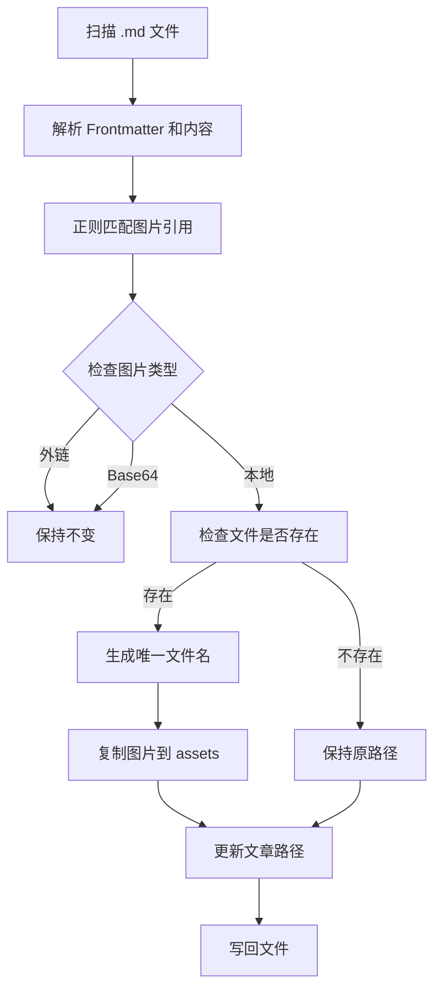

# M1.1 图片路径规范化 - 实现指南

本指南介绍如何使用 post_waver 的图片迁移功能。

---

## 📋 功能概述

图片迁移工具可以将分散在文章各处的本地图片统一迁移到 `content/assets/images/` 目录，并自动更新文章中的图片引用。

### 支持的图片格式

- **Markdown 语法**：``
- **HTML 标签**：``

### 自动处理

- ✅ **外链图片**：HTTP/HTTPS 链接保持不变
- ✅ **Base64 图片**：data:image 链接保持不变
- ✅ **本地图片**：迁移到 `/assets/images/` 目录
- ✅ **文件名冲突**：自动添加数字后缀（如 `image-1.jpg`）
- ✅ **缺失图片**：保持原路径，输出警告

---

## 🚀 快速开始

### 1. 基本用法

```bash
# 迁移 content/posts 目录中的所有图片
pnpm migrate-images
```

这将：
- 扫描 `content/posts/**/*.md` 文件
- 找到所有本地图片引用
- 复制图片到 `content/assets/images/`
- 更新文章中的图片路径

### 2. 指定目录

```bash
# 迁移特定目录
pnpm migrate-images --dir content/blog
```

### 3. 自定义 Assets 目录

```bash
# 指定目标目录
pnpm migrate-images --assets-dir public/images
```

### 4. 试运行模式

```bash
# 查看将要执行的操作，不实际修改文件
pnpm migrate-images --dry-run
```

---

## 📖 使用示例

### 示例 1: 迁移博客图片

假设你的博客文章结构如下：

```
content/posts/
├── 2024-01-01-hello-world.md
├── 2024-01-02-second-post.md
└── images/
    ├── screenshot.png
    └── diagram.jpg
```

文章中的引用：

```markdown
<!-- 2024-01-01-hello-world.md -->

```

运行迁移后：

```bash
pnpm migrate-images
```

结果：

```markdown
<!-- 2024-01-01-hello-world.md -->

```

文件结构：

```
content/
├── posts/
│   ├── 2024-01-01-hello-world.md      # ✅ 已更新
│   └── 2024-01-02-second-post.md
└── assets/
    └── images/
        ├── screenshot.png            # ✅ 已迁移
        └── diagram.jpg               # ✅ 已迁移
```

### 示例 2: 处理文件名冲突

如果多个文章使用相同文件名的图片：

```markdown
<!-- post-a.md -->


<!-- post-b.md -->

```

迁移后：

```markdown
<!-- post-a.md -->


<!-- post-b.md -->

```

### 示例 3: 混合图片类型

文章中包含多种图片类型：

```markdown
<!-- 本地图片 -->


<!-- 外链图片 -->


<!-- Base64 图片 -->


<!-- 缺失图片 -->

```

迁移后：

```markdown
<!-- 本地图片 → 已迁移 -->


<!-- 外链图片 → 保持不变 -->


<!-- Base64 图片 → 保持不变 -->


<!-- 缺失图片 → 保持原路径 -->

```

---

## 🔧 高级用法

### 与其他命令配合

```bash
# 1. 扫描内容
pnpm scan

# 2. 迁移图片
pnpm migrate-images

# 3. 同步到 Hexo
pnpm sync:hexo
```

### 仅迁移特定文件

```bash
# 使用 glob 模式（未来功能）
pnpm migrate-images --dir content/posts --pattern "**/*.md"
```

### 验证迁移结果

```bash
# 1. 检查迁移的图片
ls -la content/assets/images/

# 2. 检查文章引用
grep -r "/assets/images/" content/posts/

# 3. 查找未迁移的图片
grep -r "" content/posts/ | grep -v "/assets/images/"
```

---

## 🛡️ 最佳实践

### 1. 迁移前备份

```bash
# 备份文章
cp -r content/posts content/posts.backup

# 运行迁移
pnpm migrate-images

# 如果出错，恢复备份
# rm -rf content/posts
# mv content/posts.backup content/posts
```

### 2. 使用 Dry-run 预览

```bash
# 先试运行
pnpm migrate-images --dry-run

# 检查输出，确认无误后实际运行
pnpm migrate-images
```

### 3. 分批迁移

```bash
# 先迁移小批量测试
pnpm migrate-images --dir content/posts/2024

# 确认无误后迁移全部
pnpm migrate-images
```

### 4. 版本控制

```bash
# 提交迁移前的状态
git add content/posts
git commit -m "Before image migration"

# 运行迁移
pnpm migrate-images

# 检查变更
git diff

# 提交迁移后的状态
git add content/posts content/assets/images
git commit -m "Migrate images to assets directory"
```

---

## 🐛 故障排查

### 问题 1: 图片未迁移

**症状**：运行迁移后，图片路径未更新

**排查**：
```bash
# 检查图片是否存在
ls -la content/posts/images/

# 检查文章中的路径
cat content/posts/post.md | grep "\!\[\]"
```

**解决**：确保图片文件存在，路径正确

### 问题 2: 外链图片被修改

**症状**：HTTPS 链接被当作本地图片处理

**排查**：
```bash
# 检查链接格式
cat content/posts/post.md | grep "https://"
```

**解决**：确保使用完整的 HTTP/HTTPS URL

### 问题 3: Frontmatter 被破坏

**症状**：迁移后文章的 YAML frontmatter 格式错误

**排查**：
```bash
# 检查 frontmatter
head -10 content/posts/post.md
```

**解决**：报告 bug，迁移工具应该保留 frontmatter

### 问题 4: 权限错误

**症状**：`Error: EACCES: permission denied`

**解决**：
```bash
# 检查目录权限
ls -la content/posts/

# 修改权限
chmod -R 755 content/posts/
```

---

## 📊 输出说明

### 成功输出

```
✅ /path/to/post.md: 移动了 3 个图片

📊 迁移统计:
   - 总文件数: 5
   - 已移动图片: 12
   - 未修改文件: 2
   - 缺失图片: 1
   - 错误: 0
```

### 警告输出

```
⚠️  /path/to/post.md: 图片不存在 - ./missing.png
```

这表示图片文件不存在，路径保持不变。

### 错误输出

```
❌ /path/to/post.md: Error: EACCES: permission denied
```

这表示文件操作失败，检查权限。

---

## 🔍 内部工作原理

### 迁移流程



### 路径解析规则

| 原路径 | 解析后 | 说明 |
|--------|--------|------|
| `./images/pic.png` | `/assets/images/pic.png` | 相对路径 |
| `../images/pic.png` | `/assets/images/pic.png` | 上级目录 |
| `/absolute/path/pic.png` | `/assets/images/pic.png` | 绝对路径 |
| `https://example.com/pic.png` | `https://example.com/pic.png` | 外链保持 |
| `data:image/png;base64,...` | `data:image/png;base64,...` | Base64 保持 |

---

## 📚 API 参考

### 命令行选项

```bash
pnpm migrate-images [options]

选项：
  -d, --dir <directory>        内容目录 (默认: content/posts)
  -a, --assets-dir <directory> Assets 目录 (默认: content/assets/images)
      --dry-run               试运行，不实际修改文件
  -h, --help                  显示帮助信息
```

### 核心函数

```typescript
// packages/core/src/image-resolver.ts

// 检查是否为外链
isExternalLink(src: string): boolean

// 检查是否为 Base64 图片
isBase64Image(src: string): boolean

// 规范化本地图片路径
normalizePath(src: string, baseDir: string, options?: {
  onMissing?: (path: string) => void
}): string

// 检查图片是否存在
imageExists(src: string, baseDir: string): boolean

// 生成唯一文件名
generateUniqueFilename(filename: string, existingFilenames: Set<string>): string
```

---

## 🔗 相关资源

- [M1.1 完成报告](../milestones/done/M1.1-完成报告.md)
- [M1.1 原始需求](../milestones/M1.1-图片路径规范化.md)
- [测试文档](./test-coverage.md#m11)
- [API 文档](./api/image-resolver.md)

---

**最后更新**：2026-04-02
**维护者**：Content Hub Team
